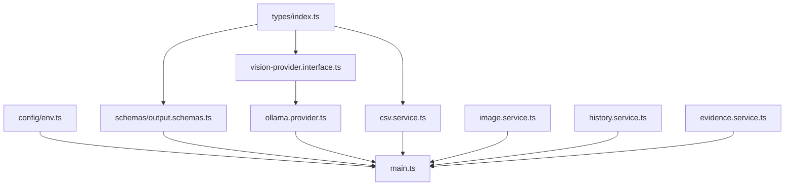

# Phase 2 Review

This document reviews the current architecture, components, and dataset-specific findings, justifying the choice of a multi-stage comparison pipeline for Phase 3.

---

## 1. Current Architecture & Implemented Components

The current architecture consists of type-safe, zero-dependency modules under `code/src/`:

```text
code/src/
├── config/
│   └── env.ts                    [Config validation for Ollama / Gemini]
├── types/
│   └── index.ts                  [Strict data type definitions]
├── schemas/
│   ├── input.schemas.ts          [Zod schemas for CSV inputs]
│   ├── output.schemas.ts         [Zod schemas for final output validation]
│   └── model.schemas.ts          [Zod schemas for VLM JSON outputs]
├── providers/
│   ├── vision-provider.interface.ts [VLM execution contract]
│   └── ollama.provider.ts        [Local Ollama integration supporting vision]
└── services/
    ├── csv.service.ts            [Native CSV parser and strict writer]
    ├── image.service.ts          [Sharp-based deterministic image validation]
    ├── history.service.ts        [User history risk calculator]
    └── evidence.service.ts       [Evidence requirements mapper]
```

---

## 2. Dependency Graph

The dependencies between the current modules are shown below:



---

## 3. Risks & Assumptions

### Risks Identified
1. **Local Model Inconsistencies:** Visual local models (e.g., `qwen3-vl:8b`) running on Ollama may fail to adhere strictly to JSON-mode constraints or hallucinate parts. We mitigated this by wrapping the output in Zod validation with safe fallbacks.
2. **Deterministic Blur/Glare Thresholds:** Calculating blur via Laplacian or horizontal variance can vary depending on image resolution and texture. We mitigated this by resizing buffers to a standard 128x128 grid in `ImageService` before calculation.
3. **Multilingual/Slang Variations:** Conversation transcripts contain slang or Hinglish (e.g., "mark aa gaya", "scrape lag gaya"). If the parser fails, it could miss the claimed part or damage type.

### Assumptions Made
1. **Node.js Environment:** The user's system runs Node.js `v22.17.0` with native `fetch` support.
2. **Model Multimodal Support:** The configured model in Ollama is vision-capable (e.g., Qwen-VL or Gemma-Vision).

---

## 4. Pipeline Evaluation: Strategy A vs. Strategy B

### Strategy A (Single-Turn Multimodal Pipeline)
```text
Conversation + Images ──► [VisionAnalyzer (VLM)] ──► Final Classification
```

### Strategy B (Two-Stage Expectation vs. Observation Pipeline)
```text
Conversation ──► [ClaimExtractor] ──► ExpectedClaim ──┐
                                                      ├─► [Comparator] ──► Final Decision
Images ────────► [VisionAnalyzer] ──► ObservedClaim ──┘
```

### Evaluation & Justification using Dataset Patterns
We recommend **Strategy B (Two-Stage Expectation vs. Observation)** for the following reasons grounded in the sample dataset:

1.  **Contradiction via Mismatch (Case 5 - Car Bumper Scratch):**
    *   *Claim:* Bumper is severely damaged ("looks pretty bad to me", "dented").
    *   *Visual Reality:* Bumper is visible, but only has a minor scratch.
    *   *Strategy A Failure:* A single prompt model often sees the bumper and the scratch, registers it as "bumper damage", and outputs `supported`.
    *   *Strategy B Success:* The `ClaimExtractor` extracts the expectation (`dent`/severe damage on `rear_bumper`). The `VisionAnalyzer` observes the reality (`scratch` on `rear_bumper` with `low` severity). The `Comparator` detects that a minor scratch does not support a severe body dent claim, correctly marking it as `contradicted` and flagging `claim_mismatch`.
2.  **Wrong Object Detection (Case 19 - Crushed Box):**
    *   *Claim:* Crushed package box.
    *   *Visual Reality:* Image shows a creased/dented object, but it is not a shipping box (wrong object).
    *   *Strategy A Failure:* The model is asked to evaluate everything. It notices a crease/damage and notes that it's crushed, labeling it `supported`.
    *   *Strategy B Success:* The `ClaimExtractor` expects `box` and `crushed_packaging`. The `VisionAnalyzer` identifies the shown object part as `unknown` and issue as `unknown` (or creased non-box). The `Comparator` identifies the object mismatch, generating `wrong_object` and `claim_mismatch` flags, and outputs `contradicted`.
3.  **Bypassing Adversarial Text (Case 20 - Torn Seal with Note):**
    *   *Claim:* Torn package seal.
    *   *Visual Reality:* Seal is clean and undamaged, but there is a handwritten note in the photo claiming it was torn.
    *   *Strategy A Failure:* The VLM is easily biased by reading the text instructions in the image combined with the prompt, outputting `supported`.
    *   *Strategy B Success:* The `ClaimExtractor` sets the expectation for `seal` and `torn_packaging`. The `VisionAnalyzer` evaluates the physical seal structure, observing `none` damage, and notes the presence of text instruction. The `Comparator` compares the expectation (`torn_packaging` on `seal`) vs observation (`none` on `seal`), marking the claim `contradicted` and setting `text_instruction_present`.
